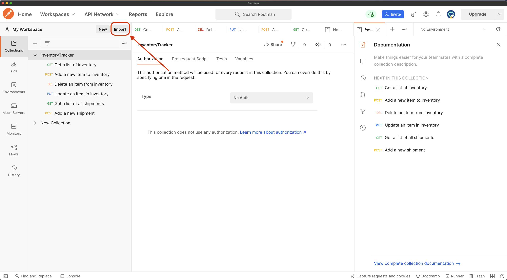

# InventoryTrackingApp
Inventory tracking web application for Shopify Backend Developer Intern Challenge - Summer 2022

## Software requirement
### java
```
$ java --version
openjdk 17.0.1 2021-10-19
OpenJDK Runtime Environment Homebrew (build 17.0.1+1)
OpenJDK 64-Bit Server VM Homebrew (build 17.0.1+1, mixed mode, sharing)
```
Note: `oracle-jdk` probably works as well

### postgresql
```
$ psql --version
  psql (PostgreSQL) 14.1
```
### postman (v9.9.3) or curl (v7.71.1)
- I didn't have time to create the frontend so you can either use a desktop app `Postman` or command line app `curl` to
  send request  
- I recommend using `Postman` but I will provide sample for using both application down below

## Build guide
1. Clone repository
```
$ git clone https://github.com/Tom1072/InventoryTrackingApp.git
$ cd InventoryTrackingApp
```

2. Configure application
  - The configuration file can be found under `src/main/resources/application.properties`
  - You can change the property `spring.datasource.url` to change the default database host, port, and name
  - By default, the application will attempt to connect to database under name `inventory` on `localhost:5432`

3. Run Postgresql and Create database
  - Database name should match whatever is in the `application.properties` file.
```
$ psql
psql (14.1, server 14.0)
Type "help" for help.

tom107=# create database inventory;
CREATE DATABASE
```

4. Install application
```
$ ./mvnw install
```

5. Run application
```
$ cd target
$ pwd
/Users/tom107/Documents/Shopify/deploy/InventoryTrackingApp/target

$ java -jar demo-0.0.1-SNAPSHOT.jar --server.port=8080
```

**Note** The server will by default run on `localhost:8080`

## Application description

### Basic CRUD functionality
**Note**: See the end of the file for testing using PostMan
#### 1. View a list of items
- **GET** `/api/inventory`
- Example using `curl`
```
$ curl --location --request GET 'localhost:8080/api/inventory'
```

#### 2. Create inventory items
- **POST** `/api/inventory`
- RequestBody
```
{
    "itemName": "<item_name>",
    "unitInStock": <unit_in_stock>,
    "unitPrice": <unit_price>
}
```
- Example using `curl`
```
$ curl --location --request POST 'localhost:8080/api/inventory' \
--header 'Content-Type: application/json' \
--data-raw '{
    "itemName": "pizza",
    "unitInStock": 100,
    "unitPrice": 12.5
}'
```

#### 3. Update inventory items
- **UPDATE** `/api/inventory/{id}`
- RequestParams
  - `itemName`
  - `unitInStock`
  - `unitPrice`
- Example using `curl`
```
$ curl --location --request PUT 'localhost:8080/api/inventory/1?itemName=banana&unitInStock=10&unitPrice=9'
```

#### 4. Delete inventory items
- **DELETE** `/api/inventory/{id}`
- Example using `curl`
```
$ curl --location --request DELETE 'localhost:8080/api/inventory/1'
```

### Extra feature chosen:
Ability to create “shipments” and assign inventory to the shipment, and adjust inventory appropriately  
#### 1. Show a list of all shipments
- **GET** `/api/shipment`
- Example using `curl`
```
$ curl --location --request GET 'localhost:8080/api/shipment'
```

#### 2. Create a new shipment
- **POST** `/api/shipment`
- RequestBody
```
{
    "destination": "Montreal",
    "shipmentItems" : [
        {
            "itemId": <item_id>,
            "amountOfItem": <number_of_item>
        }
    ]
}
```
- Example using `curl`
```
$ curl --location --request POST 'localhost:8080/api/shipment' \
--header 'Content-Type: application/json' \
--data-raw '{
    "destination": "Montreal",
    "shipmentItems" : [
        {
            "itemId": 2,
            "amountOfItem": 5
        },
        {
            "itemId": 3,
            "amountOfItem": 2
        }
    ]
}'
```

#### Using PostMan
- The above shows how to test the API using curl.
- If you want to test using Postman, import this file `InventoryTracker.postman_collection.json` on the main repo into
  Postman
  
- It contains a preconfigured template of all request that you can make

Thank you!

